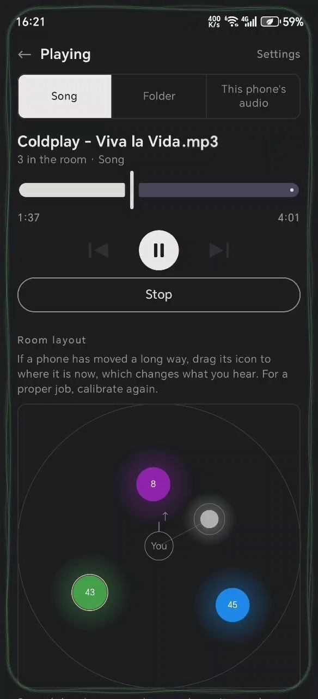
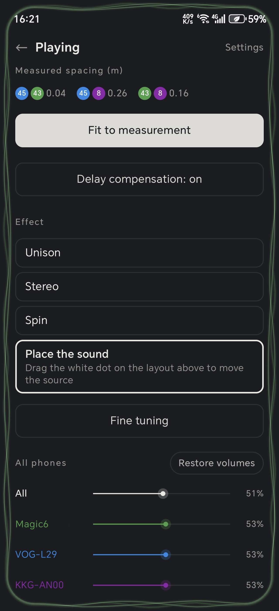
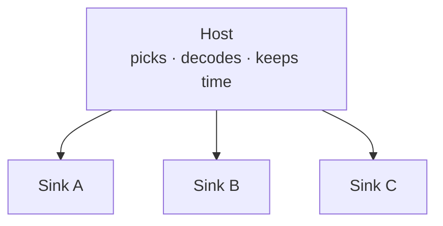

<div align="center">

<picture>
  <source media="(prefers-color-scheme: dark)" srcset="asset/github/readme-header-dark.png">
  
</picture>

**Turn a few Android phones into one set of tightly synchronised speakers**

Synchronised playback across devices on one local network, aligned to within about 0.5 ms.
No server, no cloud, nothing leaves the network.


**English** · [简体中文](README.zh-CN.md)

</div>

---

> **Disclaimer**
>
> This project is for study and technical research only. Do not use it to get around DRM, account
> access controls or any platform security mechanism; the copyright compliance of whatever is played
> is the user's own responsibility, as are all consequences of using this project.

---

## Overview

Several Android devices join one local network. One of them is the host: it picks the music, decodes
it and hands out the time, and the rest join by themselves and play in step.

Most approaches synchronise over the network alone, which cannot synchronise the delay in the
hardware, so a purely network-based approach usually leaves more than tens of milliseconds between
when the devices actually sound. Here they calibrate against one another by sound to measure that
hardware difference, which brings the alignment down to about 0.5 ms - roughly the time sound takes
to travel 17 cm, while two identical sounds have to be more than 30 ms apart before the ear can
tell them apart.

The acoustic calibration also measures the approximate distance between devices, which together
with the tight sync carries the spatial effects: stereo assignment, a source that circles the room,
a source placed by hand.

## Features

- **Tight sync** — about 0.5 ms between devices once calibrated.
- **Ranging by sound** — it measures the distance between devices itself, which together with the
  tight sync is what the spatial effects run on.
- **Not only local files** — it can capture whatever this phone is playing, online music apps
  included, and hand that out instead.
- **Nothing to set up** — one WiFi network or a hotspot is enough; no computer, server or other
  controller.

## Where it is useful

- **Parties and other rooms full of people** — devices spread around the room cover it more evenly
  than a single speaker.
- **Phones nobody uses any more** — a drawer of old handsets becomes a set of speakers, with no
  extra hardware.
- **Outdoors and anywhere temporary** — camping, halls of residence, a rented flat: nowhere with a
  stereo, built out of the devices already present.
- **Spatial effects** — several positions give a sense of direction and envelopment that one speaker
  cannot.

<p align="center">
  
  &nbsp;&nbsp;
  
</p>

<p align="center"><sub>One screen: where the phones are, and what to do with that.</sub></p>

## What it needs

| Item | Requirement |
| --- | --- |
| Devices | Two or more, Android 10+ (`minSdk 29`) |
| Network | The same WiFi; or one of them runs a hotspot as the host and the rest join it |
| Permissions | Microphone (calibration only), notifications, running in the background |
| Server | None |

## Quick start

1. Install the same build on every device (see [Build](#build)).
2. Put them on one network. One picks "Be the host", the rest "Be a sink". A sink finds the host by
   itself, or by scanning its code.
3. Run the **position and timing calibration** once, from the host. It wants a quiet room and takes
   a few tens of seconds.
4. Pick a source and play.

## What it can play

| Source | What it is |
| --- | --- |
| Song | One audio file on this phone |
| Folder | Plays a whole folder, with previous and next |
| This phone's audio | Captures what this phone is playing and hands it to every device |

What capture cannot do is under [Known limits](#known-limits).

## Spatial effects

This is what the measured positions are for.

| Effect | What it does |
| --- | --- |
| Unison | Every device plays the same thing, which is the control the other three are heard against |
| Stereo | Left and right channels assigned by where the devices actually stand |
| Spin | The source circles the room; clearer with three devices or more |
| Place the sound | Drag the source around the room layout |

## How the sync works

An Android device's audio output has a lag of its own, and it differs from model to model. Matching
clocks over the network aligns the clocks and not the instant sound actually leaves the speaker, so
SoundMesh measures that instant instead:

- **Output lead** — a device plays a signal and records at the same time; the difference between
  when it was sent and when it was heard is this device's own output lead.
- **Position and time** — the devices sound in turn and record one another; the flight time of the
  sound between each pair gives the clock offset and the distance between them at once.

Once calibrated, devices are aligned to within about **0.5 ms**. One millisecond is about 34 cm of
air.

Devices that have not been calibrated are much further apart than that. **The calibration cannot be
skipped** if this accuracy is what you are after.

## Known limits

- Every device has to be an Android device (in hotspot mode the host is the access point).
  **iOS is not supported.**
- Tested on a small number of models so far. Reports are welcome.
- Capture takes everything this phone plays rather than one chosen app, so anything else that makes
  a sound is handed out too.
- In capture mode this phone's own media volume is set to 0, and the delay end to end is about 1.5 s.
- Audio is 16-bit PCM stereo only, 8–96 kHz.
- Calibration wants a reasonably quiet room and a clear line between the devices.
- Not on any app store; the package is one you build yourself.

## Build

```bash
git clone https://github.com/Thomasff/SoundMesh.git
cd SoundMesh
./gradlew assembleDebug
```

On Windows, `gradlew.bat assembleDebug`. The package lands in `app/build/outputs/apk/debug/`.

To run the unit tests:

```bash
./gradlew test
```

## Architecture

A star. Sinks do not talk to each other.



Each connection carries two things: a command channel that stays up for as long as the room does
(role, volume, transport, who is present) and the audio stream. Audio blocks go out some seconds
early, each carrying the instant on the host's clock at which it is to sound; a sink converts that
instant to its own clock, and the output lead from the calibration is one of the terms in that
conversion.

## Licence

[GPL-3.0](LICENSE).

The SoundMesh name and icon are not covered by that licence. All rights reserved.
