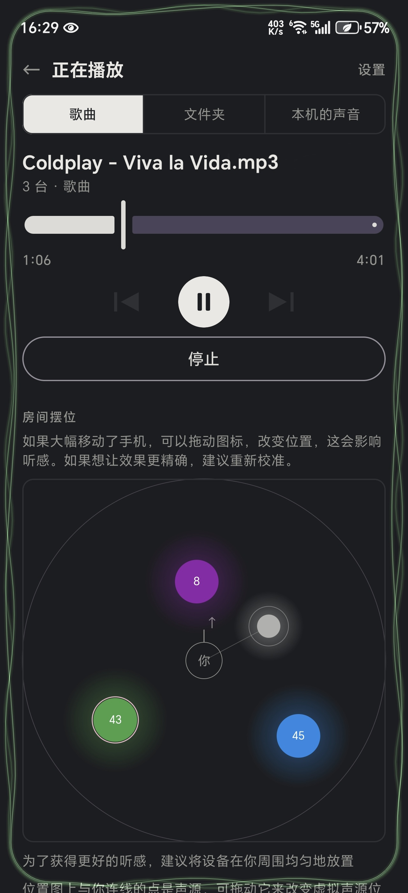
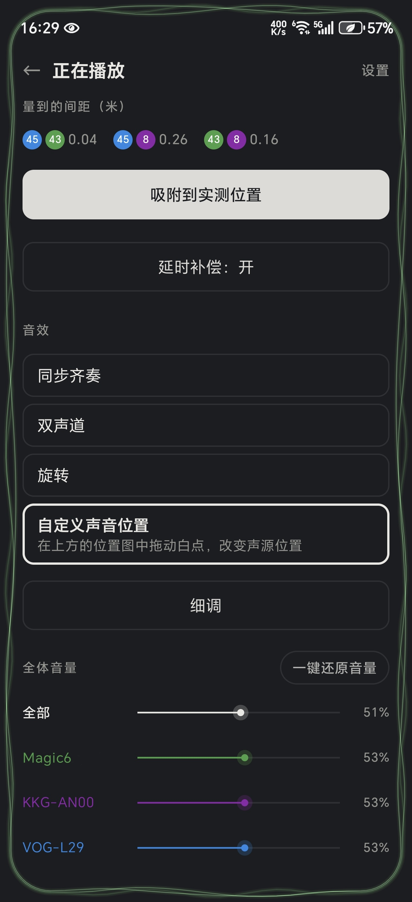
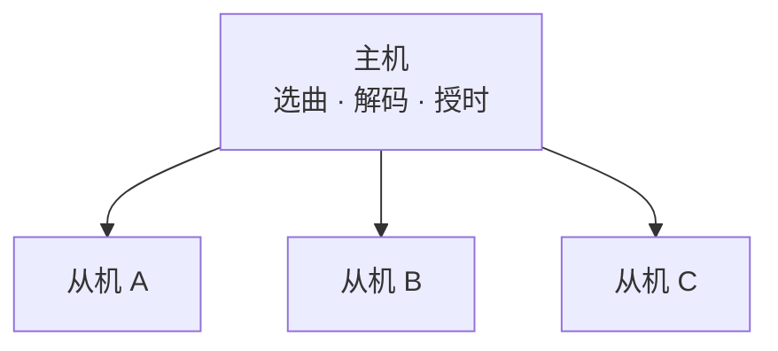

<div align="center">

<picture>
  <source media="(prefers-color-scheme: dark)" srcset="asset/github/readme-header-dark.png">
  
</picture>

**把几台安卓手机变成一套同步音箱**

同一局域网内多设备同步播放，设备间对齐误差约 0.5 ms。
无服务端、无云端、无外网通信。


[English](README.md) · **简体中文**

</div>

---

> **免责声明**
>
> 本项目仅供学习与技术研究使用。请勿用于绕过 DRM、账号访问控制或任何平台安全机制；
> 播放内容的版权合规由使用者自行负责。因使用本项目造成的一切后果由使用者自行承担。

---

## 简介

多台安卓设备接入同一局域网，一台作为主机负责选曲、解码与授时，其余设备自动加入并同步发声。
所有设备在同一时刻输出同一路音频，听感上是单一声源而非多个扬声器。

设备的相对位置由声学校准测得，可进一步用于双声道分配、声像旋转与自定义声源位置等空间音效。

## 特性

- **高精度同步** —— 校准后设备间对齐误差约 0.5 ms。
- **不限于本地文件** —— 可采集并分发本机正在播放的任意音频，包括各类在线音乐应用。
- **即开即用** —— 同一 WiFi 或热点下直接运行，无需电脑、服务器或其他控制端。

## 使用场景

- **聚会与多人场合** —— 设备分散摆放，声场覆盖比单只音箱更均匀。
- **闲置设备再利用** —— 抽屉里的旧手机无需额外硬件即可组成一套音箱。
- **户外与临时场合** —— 露营、宿舍、出租屋等没有音响的环境，用在场设备就地组建。
- **空间音效** —— 多点摆位可实现单只音箱无法呈现的方位感与环绕感。

<p align="center">
  
  &nbsp;&nbsp;
  
</p>

<p align="center"><sub>同一个界面：设备在哪，以及据此能做什么。</sub></p>

## 设备要求

| 项 | 要求 |
| --- | --- |
| 设备 | 2 台及以上，Android 10+（`minSdk 29`） |
| 网络 | 同一 WiFi；或由其中一台开启热点作为主机，其余接入 |
| 权限 | 麦克风（仅校准时使用）、通知、后台运行 |
| 服务端 | 无需部署 |

## 快速开始

1. 各设备安装同一版本安装包（见[构建](#构建)）。
2. 设备连接同一网络，一台选择"当主机"，其余选择"当从机"。从机通过自动发现或扫码连接主机。
3. 在主机上执行一次**位置同步校准**，需安静环境，耗时数十秒。
4. 选择音源，开始播放。

## 播放来源

| 来源 | 说明 |
| --- | --- |
| 单曲 | 选择本机的一个音频文件 |
| 文件夹 | 连续播放整个文件夹，支持上一首 / 下一首 |
| 本机音频采集 | 采集本机正在播放的音频并分发至全部设备 |

采集模式的限制见[已知限制](#已知限制)。

## 空间音效

测量得到的设备位置在此使用。

| 音效 | 说明 |
| --- | --- |
| 同步齐奏 | 所有设备播放相同内容，作为其余三档的对照 |
| 双声道 | 按实际摆位分配左右声道 |
| 旋转 | 声像绕房间转动，3 台及以上效果更明显 |
| 自定义声音位置 | 在房间图上拖动声源 |

## 同步原理

安卓音频输出链路存在延迟，该延迟随机型变化，仅靠网络对时只能对齐时钟，无法对齐实际发声时刻。SoundMesh 采用声学测量：
- **输出延迟** —— 设备播放信号并同步录音，由发声时刻与接收时刻之差解出本机输出延迟。
- **位置与时间** —— 各设备轮流发声、互相录音，由两两之间的声音飞行时间同时解出时间偏差与相对距离。

校准后，设备间对齐误差约 **0.5 ms**，空气中 1 ms 约合 34 cm。

未校准设备之间的偏差远超 0.5 ms，若要达到此精度，**不可跳过校准**。

## 已知限制

- 设备必须为安卓设备（热点模式下主机即接入点）。**暂不支持 iOS。**
- 目前仅在有限机型上测试过，如遇问题欢迎反馈。
- 采集模式采集的是本机全部媒体输出，而非指定应用；其他应用发声也会被分发。
- 采集模式下本机媒体音量被置 0，端到端延迟约 1.5 s。
- 音频格式限 16-bit PCM 立体声，采样率 8–96 kHz。
- 校准时要求环境较安静，且设备无遮挡。
- 未上架应用商店，仅提供自行构建的安装包。

## 构建

```bash
git clone https://github.com/Thomasff/SoundMesh.git
cd SoundMesh
./gradlew assembleDebug
```

Windows 使用 `gradlew.bat assembleDebug`。产物位于 `app/build/outputs/apk/debug/`。

运行单元测试：

```bash
./gradlew test
```

## 架构

星形拓扑，从机之间不通信。



每条连接承载两路：常驻命令通道（角色、音量、播放控制、在线状态）与音频流。
音频块提前数秒下发，每块携带主机时钟上的目标发声时刻；从机换算至本地时钟后输出，
校准所得的输出延迟作为该换算中的一项。

## 许可

[GPL-3.0](LICENSE)。

SoundMesh 的名称与图标不在本许可范围内，保留所有权利。
